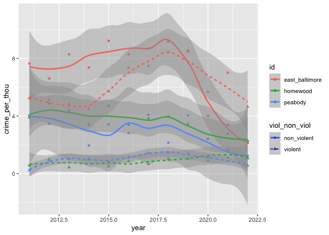

JHU_crime_map
================
Nick Thieme
2022-10-17

## Library and data load

These are the shapefiles we made by hand based on the JHU precinct maps.
We add the shapefiles together, and drop spherical from the sf options.
We also load in the crime data and spatial join it with the campus.
Finally, we load in the census data to get population counts for each of
the JHU precinct areas. This is a little more complicated than it could
be because we’re talking about areas with significant school populations
(though not entirely for non-homewood campuses) during COVID. The Census
Bureau did a good job with these, however.

``` r
library(lubridate)
library(bbplot)
library(sf)
library(tidyverse)
library(tidycensus)

#shapefiles

D_homewood<-read_sf("~/Desktop/banner_projects/crime_on_jhu/jhu_homewood.shp")
D_east_baltimore<-read_sf("~/Desktop/banner_projects/crime_on_jhu/east_baltimore.shp")
D_peabody<-read_sf("~/Desktop/banner_projects/crime_on_jhu/peabody_campus.shp")

D_homewood$id<-"homewood"
D_east_baltimore$id<-"east_baltimore"
D_peabody$id<-"peabody"

D_jhu<-rbind(D_homewood,D_east_baltimore,D_peabody) %>% st_make_valid()
sf_use_s2(FALSE)

#crime 

D_crimes <-read_sf("~/Downloads/Part_1_Crime_Data_/Part_1_Crime_Data_.shp") 
D_crimes_2<-D_crimes %>% mutate(date=ymd(CrimeDateT))

st_crs(D_crimes_2)<-st_crs(D_jhu)

jhu_joined_crimes<-st_join(D_crimes_2, D_jhu)
jhu_joined_crimes_filt<-jhu_joined_crimes %>% filter(is.na(id)==FALSE)

jhu_joined_crimes_filt_df<-jhu_joined_crimes_filt %>% as.data.frame() %>% select(-geometry) %>%
  mutate(month_date = str_c(str_sub(date, 1,8),"01") %>% ymd, year = year(month_date)) 

#census

census_list <- vector(mode = "list", length = 12)

for(i in 1:(length(census_list)-2)){
  census_list[[i]]<-get_acs(geography = "tract", state = "MD", 
                            variables=c(pop="B01003_001"), county="Baltimore City",
                            summary_var = "B01003_001",geometry = T, survey = "acs5", year= 2011+i-1) %>% add_column(year = 2011+i-1)
}

census_list[[11]]<-census_list[[10]] %>% mutate(year=2021)
census_list[[12]]<-census_list[[10]]%>% mutate(year=2022)

census_list_f<-census_list %>% do.call("rbind",.)

school_pop_year<-D_jhu %>%st_set_crs(st_crs(census_list_f)) %>%  st_join(census_list_f) %>% as.data.frame() %>% select(-geometry) %>% 
  group_by(id, year) %>%  summarise(population = sum(estimate))

jhu_joined_crimes_filt_df_cen<-jhu_joined_crimes_filt_df %>%  left_join(school_pop_year, by = c("id","year"))  %>%  distinct
```

## Analysis

There really isn’t so much analysis needed once the data is all joined.
We classify crimes as violent and nonviolent. We do three major steps.
First, we turn the data from victim-level data to incident-level data.
We care about the number of crimes, not the number of people involved in
crimes (though this doesn’t affect the final trend dramatically. It
isn’t as though there’s been a drastic increase in the number of victims
per crime in a way that would align with JHU’s reasoning). We also use
the Census population estimates to turn the incident-level data into
incidents per thousand residents, for obvious reasons. Finally, we
estimate smooths for each campus and crime type. With the number of
observations we have for each level, this means LOESS smoothing. We then
extract the smooths and use those for the final plots.

``` r
jhu_joined_crimes_filt_df_2<-jhu_joined_crimes_filt_df_cen %>% mutate(
  viol_non_viol = case_when(Descriptio%in%c("AGG. ASSAULT","COMMON ASSAULT","HOMICIDE","RAPE","ROBBERY - CARJACKING","ROBBERY - COMMERCIAL",
                                          "ROBBERY - RESIDENCE","ROBBERY - STREET","SHOOTING")~"violent",
                         
                          Descriptio%in%c("ARSON","AUTO THEFT","BURGLARY","LARCENY","LARCENY FROM AUTO")~"non_violent")
  )%>% 
  mutate(desc = fct_collapse(Descriptio, 
                             ROBBERY = c("ROBBERY - CARJACKING", "ROBBERY - COMMERCIAL", "ROBBERY - RESIDENCE", "ROBBERY - STREET"),
                             LARCENY = c("LARCENY", "LARCENY FROM AUTO"),
                             ASSAULT = c("COMMON ASSAULT", "AGG. ASSAULT"))) 

to_write_for_charts<-jhu_joined_crimes_filt_df_2%>% group_by(date, Location, GeoLocatio,Descriptio, id,viol_non_viol, Premise,CrimeCode) %>% 
  summarise(n=n(), population = population[1], month_date = month_date[1]) %>% ungroup %>% group_by(month_date, id, viol_non_viol) %>% 
  summarise(n=n(), population = population[1])%>% 
  filter(month_date>ymd("2011-01-01")) %>% mutate(crime_per_thou = n/population*1000)
```

    ## `summarise()` has grouped output by 'date', 'Location', 'GeoLocatio',
    ## 'Descriptio', 'id', 'viol_non_viol', 'Premise'. You can override using the
    ## `.groups` argument.
    ## `summarise()` has grouped output by 'month_date', 'id'. You can override using
    ## the `.groups` argument.

``` r
a<-to_write_for_charts%>% mutate(year = year(month_date)) %>% group_by(year, id, viol_non_viol) %>% 
  summarise(n = sum(n), population = population[1], crime_per_thou = n / population*1000) %>% 
  ggplot(aes(x = year, y = crime_per_thou, color= id, shape = viol_non_viol))+geom_point()+
  geom_smooth(aes(linetype=viol_non_viol), span = .5)
```

    ## `summarise()` has grouped output by 'year', 'id'. You can override using the
    ## `.groups` argument.

``` r
a
```

    ## `geom_smooth()` using method = 'loess' and formula 'y ~ x'

<!-- -->

``` r
ggplot_build(a)$data[[2]] %>% mutate(
  viol_non_viol = case_when(
    linetype=="22"~"violent",
    linetype=="solid"~"non_violent"),
  
  campus = case_when(colour=="#F8766D"~"east_baltimore",
                     colour =="#619CFF"~"peabody",
                     colour == "#00BA38"~"homewood"
                     
  ),
  year = round(x)
) %>% select(year, y,ymin,ymax ,viol_non_viol, campus) %>% group_by(year, campus, viol_non_viol) %>% summarise(y = mean(y), ymin = mean(ymin), ymax=mean(ymax)) %>% 
  filter(year<2022, viol_non_viol=="violent")  %>% pivot_wider(names_from = campus, values_from=c(y,ymin,ymax)) %>% 
  write_csv("~/Desktop/banner_projects/crime_on_jhu/dw_campus_map_year_ci_viol.csv")
```

    ## `geom_smooth()` using method = 'loess' and formula 'y ~ x'
    ## `summarise()` has grouped output by 'year', 'campus'. You can override using the `.groups` argument.

``` r
to_write_for_charts %>% group_by(month_date, id, viol_non_viol) %>% 
  summarise(n = sum(n), population = population[1], crime_per_thou = n / population*1000) %>% 
  mutate(year = year(month_date))%>% select(month_date,year, crime_per_thou ,viol_non_viol, id)  %>% 
  filter(year<2022, viol_non_viol=="violent")  %>% pivot_wider(names_from = id, values_from=crime_per_thou) %>% ungroup %>% 
  mutate(across(4:6, function(x)return(replace_na(x,0)))) %>% 
  write_csv("~/Desktop/banner_projects/crime_on_jhu/dw_campus_map_year_viol_mo.csv")
```

    ## `summarise()` has grouped output by 'month_date', 'id'. You can override using
    ## the `.groups` argument.

``` r
ggplot_build(a)$data[[2]] %>% mutate(
  viol_non_viol = case_when(
    linetype=="22"~"violent",
    linetype=="solid"~"non_violent"),
  
  campus = case_when(colour=="#F8766D"~"east_baltimore",
                     colour =="#619CFF"~"peabody",
                     colour == "#00BA38"~"homewood"
                     
  ),
  year = round(x)
) %>% select(year, y,ymin,ymax ,viol_non_viol, campus) %>% group_by(year, campus, viol_non_viol) %>% summarise(y = mean(y), ymin = mean(ymin), ymax=mean(ymax)) %>% 
  filter(year<2022, viol_non_viol=="non_violent")  %>% pivot_wider(names_from = campus, values_from=c(y,ymin,ymax)) %>% 
  write_csv("~/Desktop/banner_projects/crime_on_jhu/dw_campus_map_year_ci_non_viol.csv")
```

    ## `geom_smooth()` using method = 'loess' and formula 'y ~ x'
    ## `summarise()` has grouped output by 'year', 'campus'. You can override using the `.groups` argument.

## Checking

We also performed a great deal of spot checks. These functions make it
easier to make sure the data we use for the charts matches up with the
original raw data.

``` r
to_check<-jhu_joined_crimes_filt_df_2%>% group_by(date, Location, GeoLocatio,Descriptio, id,viol_non_viol, Premise, CrimeCode) %>% 
  summarise(n=n(), population = population[1], month_date = month_date[1]) %>% ungroup %>% group_by(month_date, id, viol_non_viol) %>% 
  summarise(n=n(), population = population[1])%>% 
  filter(month_date>ymd("2011-01-01"))
```

    ## `summarise()` has grouped output by 'date', 'Location', 'GeoLocatio',
    ## 'Descriptio', 'id', 'viol_non_viol', 'Premise'. You can override using the
    ## `.groups` argument.
    ## `summarise()` has grouped output by 'month_date', 'id'. You can override using
    ## the `.groups` argument.

``` r
D_crimes_check<-jhu_joined_crimes_filt %>% as.data.frame %>% select(- geometry) %>% 
  mutate(month_date = str_c(str_sub(CrimeDateT, 1,8),"01") %>% ymd) %>% mutate(
    viol_non_viol = case_when(Descriptio%in%c("AGG. ASSAULT","COMMON ASSAULT","HOMICIDE","RAPE","ROBBERY - CARJACKING","ROBBERY - COMMERCIAL",
                                              "ROBBERY - RESIDENCE","ROBBERY - STREET","SHOOTING")~"violent",
                              
                              Descriptio%in%c("ARSON","AUTO THEFT","BURGLARY","LARCENY","LARCENY FROM AUTO")~"non_violent")
  )

samp <- sample(1:nrow(to_check), 30)
to_check[samp,]
```

    ## # A tibble: 30 × 5
    ## # Groups:   month_date, id [30]
    ##    month_date id             viol_non_viol     n population
    ##    <date>     <chr>          <chr>         <int>      <dbl>
    ##  1 2016-01-01 homewood       violent           1      15010
    ##  2 2014-02-01 homewood       non_violent       4      16169
    ##  3 2018-04-01 east_baltimore violent           9      15046
    ##  4 2021-06-01 homewood       violent           1      14068
    ##  5 2020-12-01 homewood       violent           1      14068
    ##  6 2018-10-01 east_baltimore non_violent       7      15046
    ##  7 2012-03-01 east_baltimore non_violent      10      14676
    ##  8 2014-12-01 east_baltimore non_violent      11      15055
    ##  9 2013-09-01 east_baltimore violent           9      14479
    ## 10 2014-10-01 homewood       non_violent       4      16169
    ## # … with 20 more rows
    ## # ℹ Use `print(n = ...)` to see more rows

``` r
i = 30

to_check[samp,][i,]
```

    ## # A tibble: 1 × 5
    ## # Groups:   month_date, id [1]
    ##   month_date id      viol_non_viol     n population
    ##   <date>     <chr>   <chr>         <int>      <dbl>
    ## 1 2018-06-01 peabody non_violent       3       8847

``` r
D_crimes_check %>% 
  filter(month_date==to_check[samp,]$month_date[i], id ==to_check[samp,]$id[i], viol_non_viol==to_check[samp,]$viol_non_viol[i]) %>% 
  arrange(desc(date), Location)
```

    ##    RowID CrimeDateT CrimeCode         Location Descriptio Inside_Out Weapon
    ## 1 173523 2018-06-22        7A    0 W CENTRE ST AUTO THEFT          O     NA
    ## 2 172209 2018-06-14        7A 700 N CHARLES ST AUTO THEFT       <NA>     NA
    ## 3 171264 2018-06-07        6J   0 E MADISON ST    LARCENY       <NA>     NA
    ##   Post Gender Age  Race Ethnicity District   Neighborho Latitude Longitude
    ## 1  124      M  40 WHITE      <NA>  CENTRAL MOUNT VERNON  39.2963  -76.6157
    ## 2  124      F  25 WHITE      <NA>  CENTRAL MOUNT VERNON  39.2983  -76.6155
    ## 3  124      M  50 WHITE      <NA>  CENTRAL MOUNT VERNON  39.2985  -76.6156
    ##           GeoLocatio Premise VRIName Total_Inci       date      id month_date
    ## 1 (39.2963,-76.6157)  STREET    <NA>          1 2018-06-22 peabody 2018-06-01
    ## 2 (39.2983,-76.6155)    <NA>    <NA>          1 2018-06-14 peabody 2018-06-01
    ## 3 (39.2985,-76.6156)    <NA>    <NA>          1 2018-06-07 peabody 2018-06-01
    ##   viol_non_viol
    ## 1   non_violent
    ## 2   non_violent
    ## 3   non_violent
